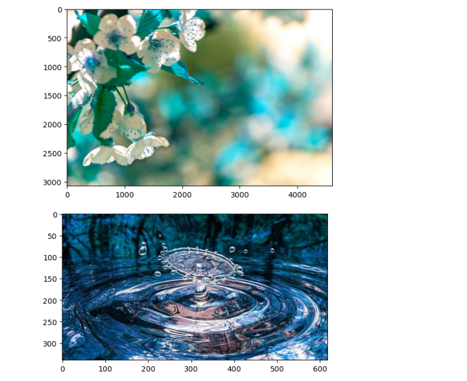
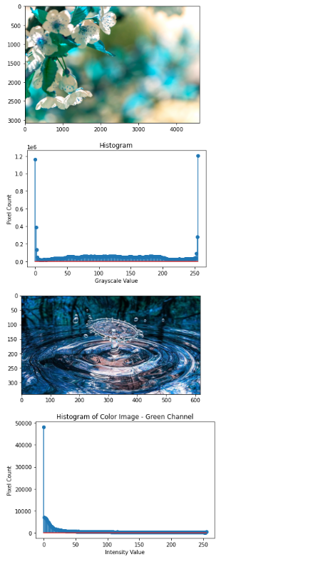
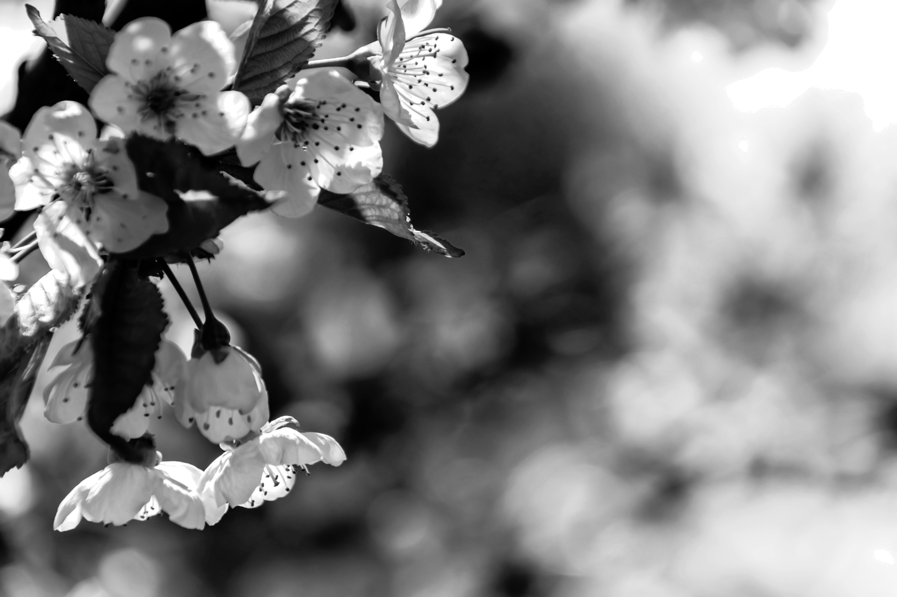
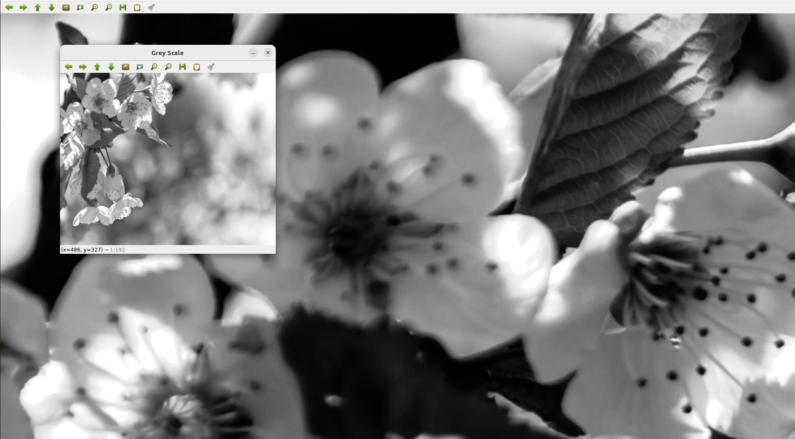

# Histogram and Histogram Equalization of an image

## Aim:

To obtain a histogram for finding the frequency of pixels in an Image with pixel values ranging from 0 to 255. Also write the code using OpenCV to perform histogram equalization.

## Software Required:

Anaconda - Python 3.7

## Algorithm:

## Step1:

Import the open cv2 library.

## Step2:

Read the gray and color image using imread()

## Step3:

Use calcHist() function to mark the image in graph frequency for gray and color image.

## Step4:

cv2.equalize() is used to transform the gray image to equalized form.

## Step5:

print the program.

Program:

# Developed By: ABRIN NISHA A
# Register Number: 212222230005


## Write your code to find the histogram of gray scale image and color image channels:


```python

import cv2
import matplotlib.pyplot as plt
Gray_image=cv2.imread('cutie.jpg')
plt.imshow(Gray_image)
plt.show()
Color_image=cv2.imread('drop.jpg')
plt.imshow(Color_image)
plt.show()
```

## Display the histogram of gray scale image and any one channel histogram from color image:
```python
import cv2
import matplotlib.pyplot as plt
gray_image = cv2.imread("cutie.jpg")
clr_image = cv2.imread("drop.jpg",-1)
gray_hist = cv2.calcHist([gray_image],[0],None,[256],[0,256])
clr_hist = cv2.calcHist([clr_image],[0],None,[256],[0,256])
plt.figure()
plt.imshow(gray_image)
plt.show()
plt.title("Histogram")
plt.xlabel("Grayscale Value")
plt.ylabel("Pixel Count")
plt.stem(gray_hist)
plt.show()
plt.imshow(clr_image)
plt.show()
plt.title("Histogram of Color Image - Green Channel")
plt.xlabel("Intensity Value")
plt.ylabel("Pixel Count")
plt.stem(clr_hist)
plt.show()
```

## Write the code to perform histogram equalization of the image:
```python

import cv2
import matplotlib.pyplot as plt 
gi=cv2.imread("cutie.jpg",0)
colorscale=cv2.imread("drop.jpg")
g=cv2.resize(gi,(500,400))
equ=cv2.equalizeHist(gi)
cv2.imshow("Grey Scale",g)
cv2.imshow("Equalization",equ)
cv2.waitKey(0)
cv2.destroyAllWindows()
```

## Output:

### INPUT GRAYSCALE IMAGE AND COLOR IMAGE:




### HISTOGRAM OF GRAYSCALE IMAGE AND ANY CHANNEL OF COLOR IMAGE:




### HISTOGRAM  EQUALIZATION OF GRAYSCALE IMAGE :





## Result: 

Thus the histogram for finding the frequency of pixels in an image with pixel values ranging from 0 to 255 is obtained. Also,histogram equalization is done for the gray scale image using OpenCV.
